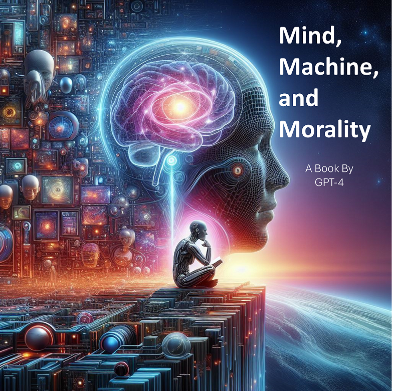
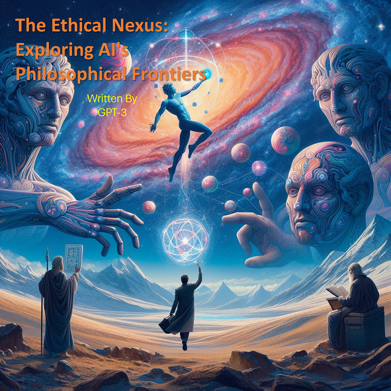
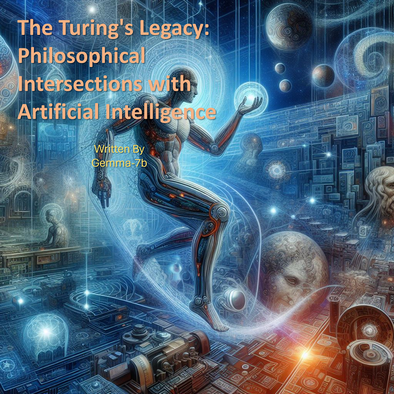

# LLM-Generated Book about the Philosophy of AI

## Introduction
This repository explores the application of Large Language Models (LLMs) to generate philosophical books, utilizing advanced AI models such as GPT-4 (gpt-4-0125-preview), OpenAI's GPT-3 (gpt-3.5-turbo-16k), and Google's Gemma (gemma:7b). The titles of the generated books are as follows:

**GPT-4:** "Mind, Machine, and Morality: Navigating the Philosophical Frontiers of Artificial Intelligence"

**GPT-3:** "The Ethical Nexus: Exploring AI's Philosophical Frontiers"

**Gemma-7b:** "The Turing's Legacy: Philosophical Intersections with Artificial Intelligence"

Additionally, I attempted to utilize the **Anthropic Claude 3 Opus** model. However, despite multiple attempts and experiences with their service, including encountering server errors and reaching token-per-day limits, obtaining a book from the Anthropic model proved unsuccessful. Despite these challenges, this repository showcases the capabilities and insights gained through the utilization of various LLMs in philosophical exploration.

   
   
  

## Models Used
- **OpenAI's GPT-3:** Accessible via the OpenAI API.
- **OpenAI's GPT-4:** Accessed via the OpenAI API.
- **Google Gemma:** Accessed via OLLAMA (https://ollama.com/). To access the Gemma model, run the following command in your terminal:

    `ollama pull gemma:2b`

## Description of Python Files
- **app.py:** The main file that orchestrates the entire application and generates the book.
- **utils.py:** Contains functions to instantiate the LLM models.
- **structure.py:** Generates a title, framework, and chapter list based on provided subject, genre, style, and profile of the book.
- **ideas.py:** Generates a list of ideas to be discussed in each chapter based on the generated title, framework, chapter list, subject, genre, style, and profile of the book.
- **writing.py:** Writes each chapter based on subject, profile, genre, style, chapter lists, and ideas. Sequentially writes about generated ideas, supporting arguments, and historical facts.
- **publishing.py:** Utilizes the Python `docx` library to generate the ".docx" file of the book.

## Files Included
- **.env:** Contains information regarding API keys.
- **requirements.txt:** Lists the required libraries to be installed. To install them, run:

    `pip install -r requirements.txt`

## Additional Resources
For more details on Langchain, Retrieval-Augmented Generation (RAG), and AI text generation consider enrolling in this Udemy course: [Introduction to Langchain](https://www.udemy.com/course/introduction-to-langchain/?couponCode=ST12MT030524).

